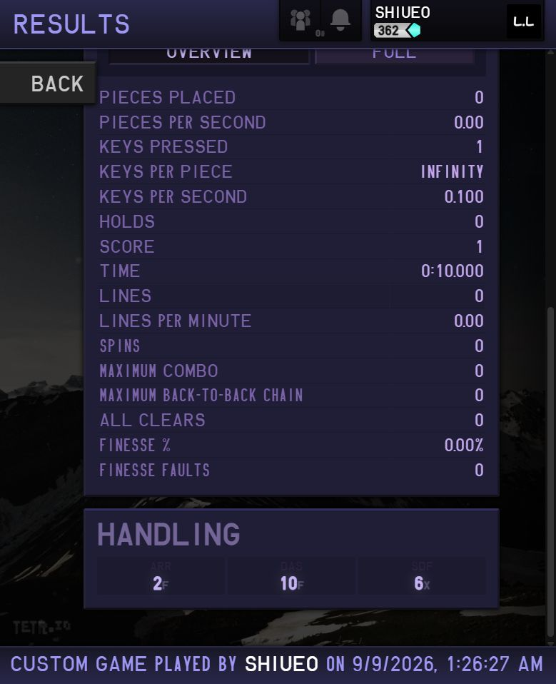
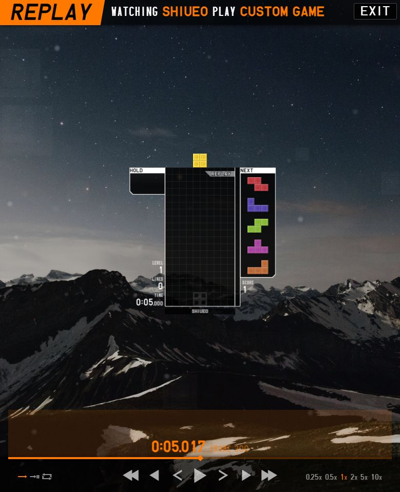
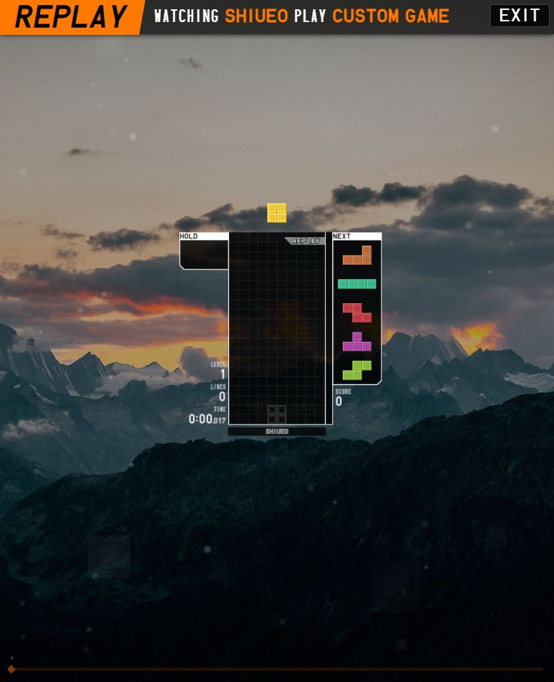
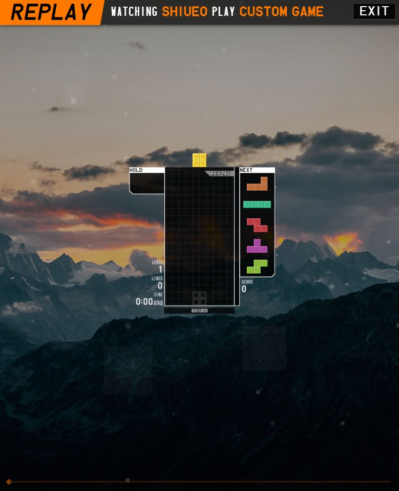
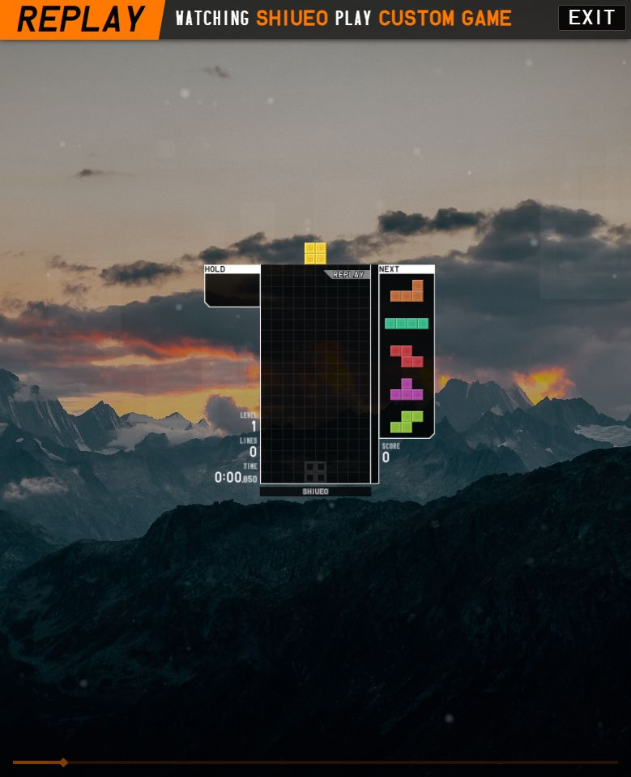

# TETR.IO live measurements — 2026-09-09

Measured on the live web client using Custom games and its own paused replay
viewer. These observations are separate from Ochimono's native/WASM tests.
Coordinates below use the top of the visible 20-row board as row 0 and increase
downward. Rows are read from the rendered grid, not internal game state.

## Setup

- Board: 10 × 20, SRS+, ARE 0, no survival garbage.
- Objective: timed, 10,000 ms, score; levelling disabled.
- Existing handling retained: ARR 2 F, DAS 10 F, DCD 2 F, SDF 6.
- Prevent accidental hard drops and prefer soft drop enabled; cancel DAS disabled.
- Both runs happened to start with O. The random seed was not fixed.
- Run A: gravity 0, one Down tap, no other gameplay inputs.
- Run B: gravity 0.02, no gameplay inputs.

The replay was paused with Space. Shift+Right and Shift+Left stepped frames;
Ctrl+Right advanced five seconds. The viewer labels its first processed frame
`frame 0` at `0:00.017`; preserve both labels instead of treating frame 0 as
elapsed time zero. Initial captures were taken after pausing and stepping, not
from an uncontrolled screenshot during a live countdown.

## Observations

| Run | Replay display | Occupied O rows | Score | Observation |
| --- | --- | --- | --- | --- |
| A, 0G | 0:00.017, frame 0 | -3, -2 | 0 | One empty row separates the piece from the skyline. |
| A, 0G | 0:05.017, frame 300 | -2, -1 | 1 | After the single Down tap, the piece is one row lower. |
| B, 0.02G | 0:00.017, frame 0 | -3, -2 | 0 | Same initial rendered position as run A. |
| B, 0.02G | 0:00.033, frame 1 | -2, -1 | 0 | One-row descent with no input. |
| B, 0.02G | 0:00.850, frame 50 | -2, -1 | 0 | Still at the same position. |
| B, 0.02G | 0:00.867, frame 51 | -1, 0 | 0 | Another row lower, 50 frames after frame 1. |

Run A's result screen reported 1 key pressed, score 1, 0 pieces placed, 0 lines,
and 10.000 seconds. Run B ended at 10.000 seconds with score 0 and no pieces
placed. This establishes that a finite-SDF tap works at 0G; it does **not** measure
the sustained soft-drop interval or prove a numeric SDF conversion formula.

The initial O position differs from Ochimono's current `y = -2` origin. In
addition, its current first gravity deadline is one full gravity interval after
spawn. Run B shows an earlier initial descent in the reference viewer. A single
O-only custom replay does not establish all pieces, modes, spawn collision
ordering or the distinction between simulation and presentation offsets. The
engine was not changed to extrapolate those unmeasured behaviors.

## Captures

### 0G, initial O

### 0G, after one soft-drop tap

### 0.02G, initial O

### 0.02G, frame 1

### 0.02G, frames 50 and 51

## Limits and restoration

The available browser input API presses and releases a key together; it does
not expose separate key-down/key-up timing. Consequently this pass could not
measure sustained DAS/ARR, DCD interruptions or finite-SDF repeat rates. Repeated
taps are not a substitute for a held key. Safe-lock and buffered simultaneous
input boundaries were not measured either.

The replay download control did not produce an observable download event or a
new file in Downloads. Captures and the measurement procedure are retained here;
there is no exported reference replay fixture from these runs.

Account handling was not changed. Custom settings were restored through the UI:
gravity 0.02, levelling ON, objective LINES, count 150, time 120,000 ms. The restored
values were checked in the live settings UI. No league game was entered.
